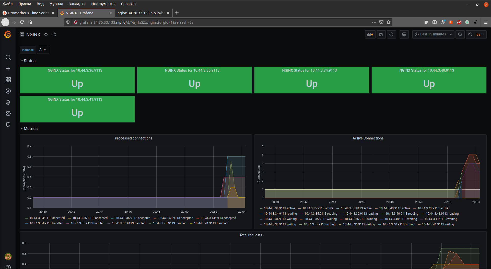

# Kubernetes-monitoring

### установка prometheus-operator в GKE

```
kubectl create ns monitoring

helm upgrade --install nginx-ingress stable/nginx-ingress --namespace=nginx-ingress -n monitoring

kubectl apply -f https://raw.githubusercontent.com/coreos/prometheus-operator/release-0.38/example/prometheus-operator-crd/monitoring.coreos.com_alertmanagers.yaml
kubectl apply -f https://raw.githubusercontent.com/coreos/prometheus-operator/release-0.38/example/prometheus-operator-crd/monitoring.coreos.com_podmonitors.yaml
kubectl apply -f https://raw.githubusercontent.com/coreos/prometheus-operator/release-0.38/example/prometheus-operator-crd/monitoring.coreos.com_prometheuses.yaml
kubectl apply -f https://raw.githubusercontent.com/coreos/prometheus-operator/release-0.38/example/prometheus-operator-crd/monitoring.coreos.com_prometheusrules.yaml
kubectl apply -f https://raw.githubusercontent.com/coreos/prometheus-operator/release-0.38/example/prometheus-operator-crd/monitoring.coreos.com_servicemonitors.yaml
kubectl apply -f https://raw.githubusercontent.com/coreos/prometheus-operator/release-0.38/example/prometheus-operator-crd/monitoring.coreos.com_thanosrulers.yaml

helm upgrade --install prometheus-operator stable/prometheus-operator --set prometheusOperator.createCustomResource=false -f prometheus-values.yaml -n monitoring
```

---

### nginx отдающий метрики

сборка обаза nginx 
```
cd nginx/
docker build -t somikhaylov/nginx-metric:v1.0.0 .
```

применение манифестов

```
kubectl apply -f deployment.yaml -n monitoring
kubectl apply -f service.yaml -n monitoring
kubectl apply -f servicemonitor.yaml -n monitoring
kubectl apply -f ingress.yaml -n monitoring
```

---

dashboard grafana для nginx



---