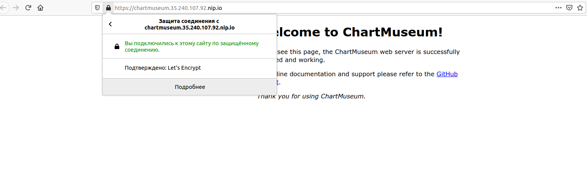
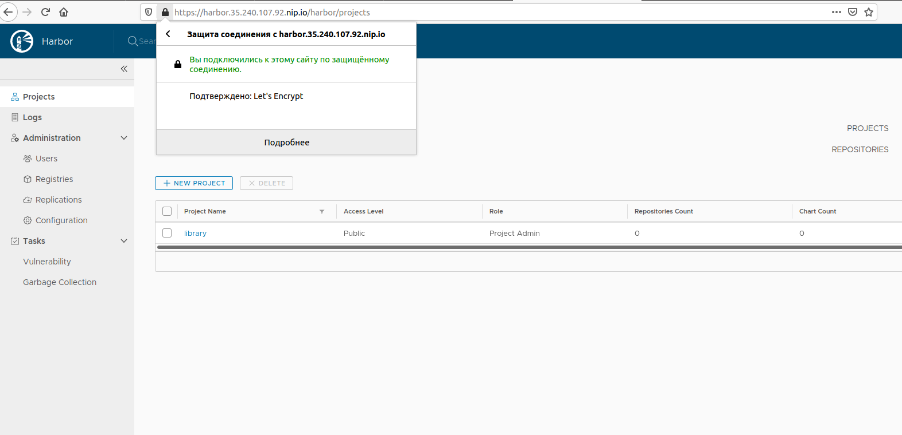

# kubernetes-templating

### add helm repo

```
helm repo add stable https://kubernetes-charts.storage.googleapis.com
helm repo add jetstack https://charts.jetstack.io
```

---


### cert-manager 

установка nginx-ingress
```
kubectl create ns nginx-ingress
helm upgrade --install nginx-ingress stable/nginx-ingress --wait --namespace=nginx-ingress --version=1.39.1
```

установка cert-manager
```
cd cert-manager/
kubectl apply -f cert-manager-ns.yaml
kubectl label namespace cert-manager certmanager.k8s.io/disable-validation="true"
helm upgrade --install cert-manager jetstack/cert-manager --wait --namespace=cert-manager --version=0.15.1 --set installCRDs=true
kubectl apply -f prod_issuer.yaml
```

---

### chartmuseum

```
kubectl create ns chartmuseum
helm upgrade --install chartmuseum stable/chartmuseum --wait --namespace=chartmuseum --version=2.6.0 -f chartmuseum/values.yaml
```

проверка - https://chartmuseum.35.240.107.92.nip.io



---

### Задание со `*` chartmuseum

создаем helm chart
```
helm create web-deployment
rm -rf web-deployment/templates/*
rm -f web-deployment/values.yaml
cp ../kubernetes-networks/web-deploy.yaml web-deployment/templates
helm package web-deployment
```

добавляем репозиторий chartmuseum 
```
helm repo add chartmuseum https://chartmuseum.35.240.107.92.nip.io/
```
добавим чарт в репозиторий с помощью curl
```
curl -k --data-binary "@web-deployment-0.1.0.tgz" https://chartmuseum.35.240.107.92.nip.io/api/charts
```
4. устанавливаем из репозитория
```
helm repo update
helm install chartmuseum/web-deployment --generate-name
```

---

### Harbor

добавляем репозиторий харбор
```
helm repo add harbor https://helm.goharbor.io
```
2. создаем namespace harbor
```
kubectl apply -f harbor/harbor-ns.yaml
```
3. устанавливаем harbor
```
helm upgrade --install harbor harbor/harbor --wait --namespace=harbor --version=1.1.2 -f harbor/values.yaml
```

проверка - https://harbor.35.240.107.92.nip.io



---

### Задание со `*` helmfile

```
cd helmfile/
helmfile -e prod apply
```
> требуется создать namespaces: nginx-ingress, cert-manager, harbor
---

### hipster-shop

```
kubectl create ns hipster-shop
helm upgrade --install hipster-shop hipster-shop --namespace hipster-shop
```

frontend

```
helm upgrade --install frontend frontend --namespace hipster-shop
helm dep update hipster-shop
```

изменение параметров с помощью --set
```
helm upgrade --install hipster-shop kubernetes-templating/hipster-shop --namespacehipster-shop --set frontend.service.NodePort=31234
```
проверка - https://shop.35.240.107.92.nip.io/

---

## kubecfg

```
kubecfg show services.jsonnet
kubecfg update services.jsonnet --namespace hipster-shop
```

---

# kustomize

```
kubectl apply -k kustomize/overrides/hipster-shop/
```

---